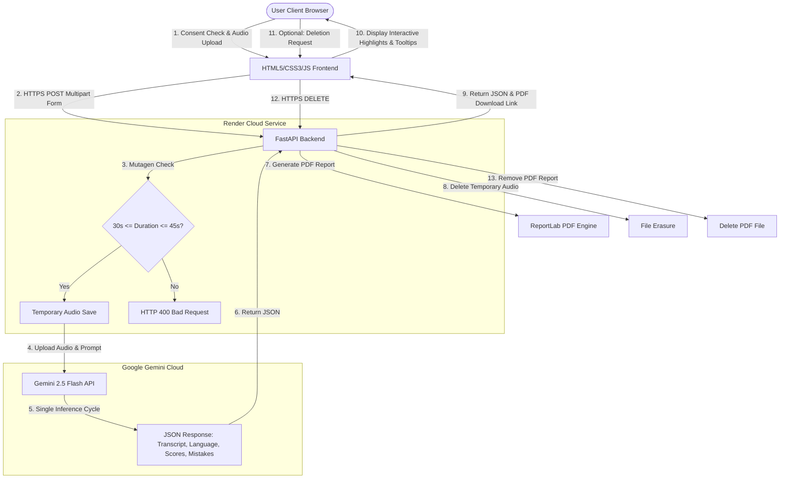

# System Architecture & DPDP Compliance Document

## 1. System Architecture

The AI Pronunciation Evaluator is a lightweight, responsive, and secure web application. It connects a vanilla HTML5/CSS3/JavaScript frontend with a FastAPI backend, utilizing Google's **Gemini 2.5 Flash** multimodal API to process audio transcription and pronunciation diagnostics in a single, secure cloud-based inference cycle.

### Architecture Diagram

### Components & Connections

1. **Frontend Client (Web Browser):**
   - **UI/UX Layer:** Built with HTML5, CSS3 (featuring custom glassmorphism styling, floating microphone animations, and responsive grids), and Font Awesome icons.
   - **Control Layer (JavaScript):** Validates the audio file size and duration, checks the explicit **DPDP Consent Box**, handles file uploads, renders the interactive transcript (converting static JSON output to clickable HTML spans with wavy outlines), and implements tooltips.
2. **FastAPI Backend (Render):**
   - **API Layer:** Handles CORS, serves health checks, and processes requests on `/upload-audio`, `/download-report/{filename}`, and `/delete-report/{filename}`.
   - **File Validation (Mutagen):** Inspects the metadata of uploaded files (`.mp3`, `.wav`, `.m4a`) to enforce the strict **30 to 45 seconds** constraint.
   - **PDF Engine (ReportLab):** Dynamically builds an assessment PDF report containing the speaker's scores, transcript, suggestions, and marked mistakes for offline study.

---

## 2. Model Selection & Rationale

| Phase | Model / API Used | Alternatives Considered | Rationale |
| :--- | :--- | :--- | :--- |
| **Speech-to-Text (STT)** | **Google Gemini 2.5 Flash** (Multimodal) | OpenAI Whisper (Local), Google Cloud STT, Deepgram | Running Whisper locally requires loading PyTorch (~500MB RAM, ~1.5GB disk). This exceeds the 512MB RAM ceiling on free hosting tiers (e.g. Render), leading to **OOM crashes**. Gemini 2.5 Flash natively accepts audio files, transcribes them with high accuracy, and performs the analysis in a single request—saving RAM, API latency, and host costs. |
| **Acoustic & Pronunciation Assessment** | **Google Gemini 2.5 Flash** | Wav2Vec2, Phoneme Alignment models | Specialized phoneme models (like Wav2Vec2) require heavy local GPU/CPU compute, complex phonetic dictionaries (ARPAbet), and manual script alignment. Gemini 2.5 Flash is highly adept at listening to vocal cadence, detecting syllable stress, and identifying mispronunciations using general acoustic-language understanding, making it perfect for rapid product deployment. |
| **Language Detection** | **Google Gemini 2.5 Flash** | Langdetect, FastText | Language detection is performed directly on the audio input by Gemini. If non-English is detected, the API returns a localized error immediately, eliminating external dependencies. |

---

## 3. Pronunciation Scoring & Highlight Logic

Scoring and diagnostic highlights are evaluated in a single prompt sent to the Gemini 2.5 Flash model:

### Pronunciation Scores

The speaker is graded across four metrics:
1. **Pronunciation Score (0-100):** Reflects vowel clarity, consonant articulation, and word stress.
2. **Fluency Score (0-100):** Reflects natural speech flow, pauses, hesitations, and pacing.
3. **Clarity Score (0-100):** Reflects how easily an average English speaker would understand the speech.
4. **Overall Score (0-100):** Weighted average of pronunciation, fluency, and clarity.
5. **Pace Evaluation:** Evaluated as **Too Slow**, **Good**, or **Too Fast**.

### Highlighting Mechanism

* **AI Diagnostics:** The prompt instructs Gemini to output a structured JSON list of `mispronounced_words`. Each object in the list contains:
  - `word`: The exact word mispronounced (matching spelling in the transcript).
  - `severity`: **Low**, **Medium**, or **High**.
  - `issue`: Acoustic description of what went wrong (e.g., *"Merged the 'sh' and 's' sounds"*).
  - `tip`: Actionable tip for correction (e.g., *"Position the tongue behind the lower teeth"*).
* **Frontend Interactive Highlights:** The JavaScript tokenizer matches words in the verbatim transcript against the `mispronounced_words` array. Words that match are wrapped inside:
  `...`
  This adds a red wavy underline, a glowing hover state, and displays a custom **interactive tooltip** showing the diagnostic severity, issue, and tip.

---

## 4. DPDP Act 2023 Compliance Posture

The Digital Personal Data Protection (DPDP) Act 2023 governs how personal data—including biometric voice recordings—of Indian citizens (Data Principals) is handled. Our application integrates DPDP compliance at its core:

1. **Consent Manager (Section 6):**
   - **Explicit & Affirmative:** Users cannot upload or analyze audio unless they explicitly check the consent checkbox.
   - **Clear Notice:** A dedicated "DPDP Compliance Notice" modal is available, detailing who is processing the data, the exact purpose, and retention limits.
2. **Purpose Limitation (Section 5):**
   - Voice recordings are processed **solely** for providing pronunciation feedback. The data is never used for voice profiling, tracking, or advertising.
3. **Storage Limitation & Right to Erasure (Section 8 & 12):**
   - **Audio Data:** Audio files are stored temporarily on the server, uploaded to the Gemini API, and **permanently deleted immediately after processing** (usually in less than 30 seconds). No audio files are retained on our servers.
   - **PDF Reports:** Generated reports are saved temporarily for download. We run an automated background task (`cleanup_old_reports`) that scans the `reports` directory and deletes any reports older than **24 hours**.
   - **On-Demand Erasure:** The results page features a **"Delete All My Data"** button. Clicking this triggers a `DELETE` request to `/delete-report/{filename}`, instantly wiping the report from the server.
4. **Data Residency:**
   - Temporarily saved files are kept in the backend's local directory, avoiding persistent database syncing outside sovereign bounds.

---

## 5. Engineering Trade-offs & Next Steps

### Trade-offs Made
* **Cloud Multimodal API vs. Specialized Acoustic Models:** We chose Gemini 2.5 Flash's native audio capabilities over local Wav2Vec2/Whisper. This traded local compute control for OOM-proofing on free-tier platforms, drastically lower server setup complexity, and reduced latency.
* **No Database Architecture:** We opted not to use a database (SQL/NoSQL). All data is passed in-memory or stored as temporary files (audio/PDF) that are quickly erased. This eliminated the storage overhead and DB hosting costs, while naturally reinforcing DPDP compliance since no persistent database exists to be breached.

### What We Would Build Next (Given Another Week)
1. **Phoneme-Level Alignment Visualizer:** Show the exact IPA (International Phonetic Alphabet) transcription comparisons for mispronounced words.
2. **Audio Playback for Specific Words:** Let the user click on a mispronounced word in the transcript to play back *just their recording of that word* alongside a model pronunciation (TTS).
3. **User Accounts & Historical Progress Tracking:** Add secure authentication (OTP/OAuth) with DPDP-compliant user profiles to track pronunciation score improvements over time.
4. **Data Residency Upgrades:** Store temporary assets in a localized cloud bucket (like AWS S3 Mumbai) with strict lifecycle policies.
